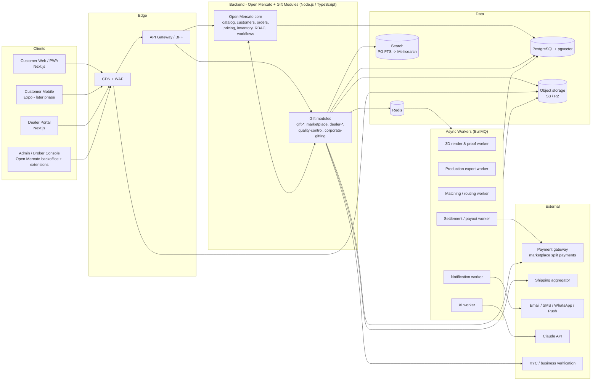
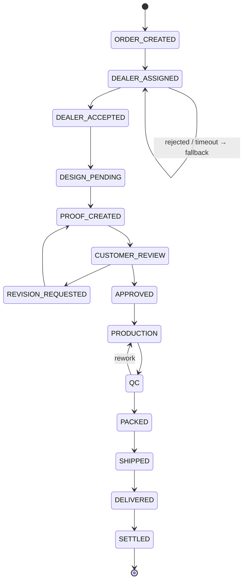
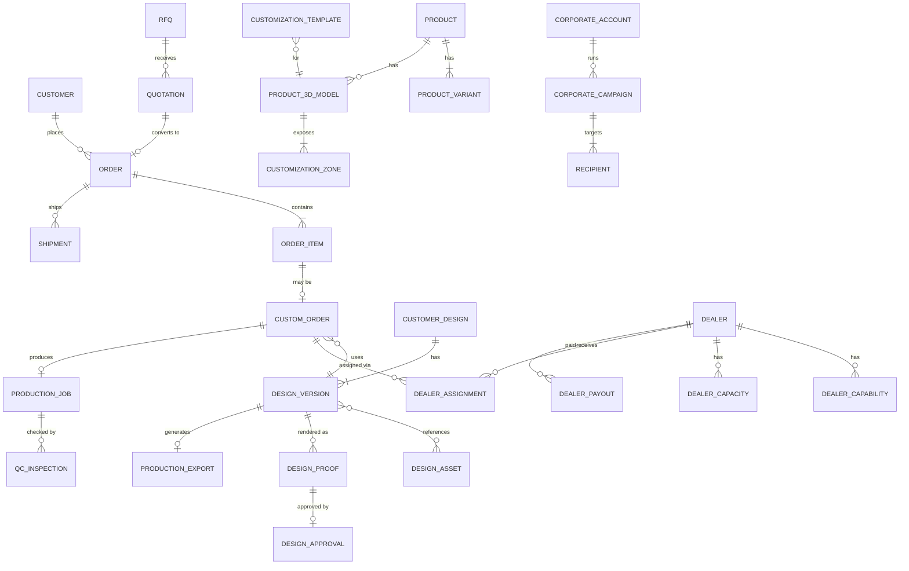

# Gift Marketplace — Architecture & Tech Stack

> **Status:** Draft v0.1 (2026-10-05). Derived from `Gift_Marketplace_Complete_Phased_Plan.docx`.
> **Audience:** engineers, tech leads and architects building the platform.
> **Scope:** system architecture, the complete technology stack, module boundaries, data model, workflows, infrastructure and non-functional requirements.

Items marked **(Decision needed)** are not settled by the product plan and must be closed in Phase 0. Items marked **(Verify)** depend on how the Open Mercato version we adopt actually works.

> **Phase 1 implementation notes (2026-10-05): confirmed against Open Mercato 0.8.0**
> - Backend: Open Mercato 0.8.0 (`apps/mercato`), Next.js 16, React 19, **MikroORM 7**, **Awilix** DI, Zod 4. Package manager is **Yarn 4** (Open Mercato's own tooling requires it), not pnpm. Node ≥ 24.
> - Native modules in use: `catalog`, `sales`, `checkout`, `customer_accounts`, `portal`, `payment_gateways`, `gateway_stripe`, `shipping_carriers`, `wms`, `currencies`, `workflows`, `search`, `audit_logs`, `attachments`, and others. App modules live in `apps/mercato/src/modules/<id>`.
> - Database: **Supabase-hosted PostgreSQL 17** (project `ovrkbaioszcdksrpzyua`, AWS ap-south-1), reached by direct connection. The app connects as `postgres` and does **not** use Supabase's Data API (PostgREST). Access for the Data API roles (`anon`, `authenticated`) to the `public` schema is revoked.
> - Queues/cache in local dev use Open Mercato's local strategies (file queue, SQLite cache). Redis and Meilisearch are optional until production.
> - Payments: **both Stripe** (native `gateway_stripe`) **and Razorpay** (app module `gateway_razorpay`). Base currency **INR**.

---

## Table of Contents

1. [Architecture Principles](#1-architecture-principles)
2. [System Context](#2-system-context)
3. [Tech Stack Summary](#3-tech-stack-summary)
4. [Applications (Frontends)](#4-applications-frontends)
5. [Backend: Open Mercato + Gift Modules](#5-backend-open-mercato--gift-modules)
6. [3D Customization Engine](#6-3d-customization-engine)
7. [Marketplace & Dealer Orchestration](#7-marketplace--dealer-orchestration)
8. [Custom Order & Production Workflow](#8-custom-order--production-workflow)
9. [Payments, Commission & Payouts](#9-payments-commission--payouts)
10. [AI Layer](#10-ai-layer)
11. [Data Architecture](#11-data-architecture)
12. [Integrations](#12-integrations)
13. [Security & Privacy](#13-security--privacy)
14. [Infrastructure & Deployment](#14-infrastructure--deployment)
15. [Observability](#15-observability)
16. [Testing Strategy](#16-testing-strategy)
17. [Repository Layout](#17-repository-layout)
18. [Feature → Implementation Matrix](#18-feature--implementation-matrix)
19. [Stack by Phase](#19-stack-by-phase)
20. [Open Decisions](#20-open-decisions)
21. [Risks](#21-risks)

---

## 1. Architecture Principles

1. **Open Mercato is the foundation, not the product.** Use it for commerce/ERP work that doesn't set us apart (catalog, customers, orders, pricing, inventory, RBAC, workflows). Don't fork or heavily modify its core; extend it through modules.
2. **The differentiator lives in our own modules:** 3D customization, dealer orchestration, the proof/production workflow, gift intelligence and corporate gifting.
3. **Headless and API-first.** Customer, dealer and admin UIs talk to the backend through APIs only.
4. **Multi-dealer from day one.** Every order item can have a dealer assignment, even when the MVP assigns dealers manually.
5. **Workflow-driven and auditable.** Every custom-order state change is an explicit transition with actor, timestamp and reason.
6. **Design data ≠ production data.** A design is a structured configuration. Production files are generated from it on the server and never taken from a browser screenshot.
7. **Stateless services, async by default.** Rendering, exports, notifications, matching and payouts run as background jobs with retries and idempotency.
8. **One language end to end.** TypeScript on frontend, backend and workers, matching Open Mercato, so models and validation schemas are shared.

---

## 2. System Context



---

## 3. Tech Stack Summary

| Layer | Technology | Notes |
|---|---|---|
| **Language** | TypeScript (strict) | Everywhere: apps, backend modules, workers, shared packages |
| **Runtime** | Node.js LTS (22.x) | Match the version Open Mercato supports **(Verify)** |
| **Commerce/ERP base** | Open Mercato | Modular TS/Next.js-based platform with an ORM over PostgreSQL **(Verify exact internals: ORM, DI, event bus)** |
| **Customer storefront** | Next.js (App Router), React | SSR/ISR for SEO, server components for catalog pages |
| **Dealer portal** | Next.js, React | Separate app that shares the UI package |
| **Admin console** | Open Mercato backoffice + custom pages | Extend rather than rebuild |
| **Mobile (later)** | PWA first, then React Native (Expo) | Mobile app reuses API client and validation packages |
| **UI** | Tailwind CSS, shadcn/ui (Radix primitives), lucide icons | One design system shared across apps |
| **Client state / data** | TanStack Query (server state), Zustand (3D editor state) | |
| **Forms & validation** | React Hook Form + Zod | Zod schemas shared with backend |
| **3D runtime** | Three.js via React Three Fiber + drei | WebGL2; WebGPU only behind a flag later |
| **3D assets** | glTF 2.0 / GLB, Draco or Meshopt compression, KTX2/Basis textures | Authored in Blender, optimized with gltf-transform |
| **2D compositing** | Canvas 2D / OffscreenCanvas (client), sharp + node-canvas (server) | Builds zone textures and print files |
| **Server rendering (proofs)** | Headless Chromium (Playwright) running the same Three.js scene | Deterministic proof renders |
| **Production export** | sharp (raster), pdf-lib (PDF), SVG for engraving/vector | 300 DPI print files with bleed and safe areas |
| **Database** | PostgreSQL 17 on Supabase | Primary store for Open Mercato and all gift modules. Direct connection only; Data API roles revoked |
| **Vector search** | pgvector | Embeddings for gift recommendation and AI retrieval |
| **Cache / queues** | Redis 7 | Cache, rate limiting, sessions, BullMQ queues |
| **Background jobs** | BullMQ | Retries, backoff, idempotency keys, dead-letter queues |
| **Search** | PostgreSQL FTS (MVP) → Meilisearch (Phase 9) | Typo tolerance, facets, synonyms |
| **Object storage** | S3-compatible (AWS S3 or Cloudflare R2) | Models, uploads, proofs, production files, QC evidence |
| **CDN / WAF** | CloudFront or Cloudflare | Static assets, GLB delivery, image resizing |
| **Payments** | Stripe (`gateway_stripe`) **and** Razorpay (`gateway_razorpay`) | Split payouts (Stripe Connect / Razorpay Route) in Phase 2 |
| **Shipping** | Aggregator via adapter: EasyPost/Shippo *or* Shiprocket | **(Decision needed: target region)** |
| **Email** | Resend or Amazon SES, React Email templates | |
| **SMS / WhatsApp** | Twilio or Meta WhatsApp Cloud API | |
| **Push** | Firebase Cloud Messaging | Web push + mobile |
| **AI** | Claude API (`claude-sonnet-5-5`, `claude-haiku-4-5-20251001`), embeddings provider, image-generation provider | See [§10](#10-ai-layer) |
| **Auth** | Open Mercato auth + RBAC; customer OTP/social login | **(Verify built-in options)** |
| **Containers** | Docker (multi-stage builds) | |
| **Orchestration** | Managed containers (AWS ECS Fargate) for MVP; Kubernetes (EKS) only if scale requires | |
| **IaC** | Terraform | All environments |
| **CI/CD** | GitHub Actions | Lint, test, build, scan, deploy |
| **Monorepo** | `apps/mercato` (Yarn 4, Open Mercato tooling) + `apps/storefront` (npm) | Revisit a workspace tool once shared packages exist |
| **Observability** | OpenTelemetry, Grafana (Prometheus/Loki/Tempo) or a managed equivalent, Sentry | |
| **Logging** | pino (structured JSON) | Correlation IDs across HTTP and jobs |
| **Testing** | Vitest, Playwright, Testcontainers, k6 | Visual regression for 3D renders |
| **Code quality** | ESLint, Prettier, TypeScript strict, Husky + lint-staged | |
| **Security tooling** | Dependabot/Renovate, `pnpm audit`, Trivy (images), license scanner | License inventory is a Phase 0 gate |

---

## 4. Applications (Frontends)

### 4.1 Customer Storefront — `apps/storefront`

- **Next.js App Router.** Catalog, occasion and product pages are statically generated with incremental revalidation (ISR). Cart, checkout and account are dynamic.
- **SEO:** structured data (Product, Offer, BreadcrumbList), sitemaps, canonical URLs.
- **3D editor** is loaded lazily on customizable product pages only, so the rest of the storefront stays light.
- **2D fallback:** if WebGL is unavailable, the device is low-end, or the user prefers it, show the same zone-based editor on flat product views. Required for accessibility and the low-end-device risk.
- **PWA:** installable, with offline-tolerant cart and web push.

### 4.2 Dealer Portal — `apps/dealer-portal`

- Onboarding/KYC, catalog and capability management, pricing, capacity and service areas.
- Order/RFQ inbox: accept, reject and quote.
- Proof upload, production status updates, QC evidence upload (photo/video), shipping labels.
- Payout dashboard and statements.
- Desktop-first, but usable on phones because dealers update status from the shop floor.

### 4.3 Admin / Broker Console

- Built on the **Open Mercato backoffice**, extended with gift-specific pages: dealer approval, manual assignment, matching rules, RFQ comparison, proof/QC oversight, commission and payout, disputes, 3D model/template and zone management, audit logs.
- Roles: Broker/Admin, Operations/QC, Finance (see [§13](#13-security--privacy)).

### 4.4 Corporate Gifting Portal (Phase 8)

- Can live inside the storefront under `/business` with corporate roles, or ship as a separate app if the UX diverges. Covers campaigns, CSV/Excel recipient upload, approvals, branding and billing.

### 4.5 Shared Frontend Packages

| Package | Contents |
|---|---|
| `packages/ui` | Design system: Tailwind config, shadcn/ui components, tokens |
| `packages/api-client` | Typed API client generated from OpenAPI, plus TanStack Query hooks |
| `packages/schemas` | Zod schemas shared by frontend and backend (design config, RFQ, etc.) |
| `packages/editor-3d` | The 3D customization editor (React Three Fiber) |

---

## 5. Backend: Open Mercato + Gift Modules

### 5.1 What Open Mercato provides

Catalog and products/variants, customers/CRM, orders, pricing, inventory, organizations, RBAC, multi-tenancy, workflows/events, and headless APIs. **(Verify)** each of these in the Phase 0 capability-mapping spike before relying on it.

### 5.2 Extension rules

- Gift modules are **separate packages** registered with Open Mercato's module system. They don't edit core files.
- Core entities are extended through the platform's extension mechanism (custom fields or linked entities). Gift-only entities live in module-owned tables.
- Modules communicate through **domain events** (e.g. `order.paid`, `proof.approved`, `qc.passed`) instead of calling each other's internals.
- If something can't be done without changing core code, contribute it upstream or keep it as a documented, minimal patch with its own tests.

### 5.3 Domain modules

| Engine | Modules | Owns |
|---|---|---|
| **Commerce** (mostly Open Mercato) | core + `gift-catalog` | Products, variants, gift metadata, pricing |
| **Gift Experience** | `gift`, `gift-occasion`, `gift-bundle`, `gift-recommendation` | Occasions, bundles, Build-a-Gift, registry, scheduled/surprise delivery |
| **3D Customization** | `gift-customization`, `gift-3d`, `gift-design` | 3D models, zones, templates, designs, versions, assets, exports |
| **Marketplace** | `marketplace`, `dealer`, `dealer-matching`, `dealer-rfq`, `dealer-quotation`, `dealer-capacity`, `marketplace-commission`, `marketplace-payout` | Dealers, capabilities, matching, RFQ, quotes, commission, payouts |
| **Production** | `gift-proof`, `gift-production`, `quality-control` | Proofs, approvals, production jobs, QC, rework |
| **Corporate** | `corporate-gifting` | Corporate accounts, campaigns, recipients, approvals |
| **Intelligence** | `gift-ai` | Assistant, message generation, enrichment, ranking assistance |

### 5.4 API strategy

- **REST + OpenAPI 3.1**, consistent with Open Mercato's API style **(Verify)**. Typed clients are generated into `packages/api-client`.
- Three API surfaces with separate auth scopes: **storefront** (public + customer), **dealer**, **admin**.
- **Idempotency keys** on every POST that creates money, orders or assignments.
- **Webhooks in** (payments, shipping) are verified, stored raw, then processed by workers.
- **Webhooks out** (Phase 9): dealer and corporate integrations can subscribe to order events.
- Cursor pagination, consistent error envelope, API versioning through the URL prefix (`/v1`).

### 5.5 Async processing

All slow or failure-prone work goes through **BullMQ on Redis**:

| Queue | Jobs |
|---|---|
| `render` | Proof renders, thumbnails, share images |
| `export` | Production package generation |
| `matching` | Dealer ranking, assignment timeouts, fallback reassignment |
| `notifications` | Email, SMS, WhatsApp, push |
| `finance` | Settlement, payout batches, reconciliation |
| `media` | Upload validation, malware scan, resize, EXIF stripping |
| `ai` | Enrichment, embeddings, recommendation refresh |
| `scheduled` | Scheduled/future deliveries, SLA breach checks |

Every job is idempotent, retries with exponential backoff, and lands in a dead-letter queue that shows up in the admin console.

To keep database writes and event publishing consistent, use the **transactional outbox pattern**: events are written to an `outbox` table in the same transaction as the state change, then a relay publishes them to queues.

---

## 6. 3D Customization Engine

This is the core differentiator. It has three parts: an **asset pipeline**, a **client editor** and a **server render/export service**.

### 6.1 Asset pipeline

```
Blender (authoring) → GLB export → gltf-transform (validate, Draco/Meshopt, KTX2, LODs)
   → zone metadata JSON → upload to object storage → registered as Product3DModel
```

**Asset standards** (set in Phase 0, enforced by CI validation):

- **Format:** glTF 2.0 binary (`.glb`).
- **Units/axes:** meters, Y-up, right-handed, origin at the product's base center.
- **Named zones:** each customizable surface is a named mesh or material (`zone_front`, `zone_back`, `zone_engrave`) with a clean UV layout that maps 1:1 to the print area.
- **LODs:** low/medium/high variants for progressive loading. Budgets: ≤ 1.5 MB low, ≤ 5 MB high; textures ≤ 2048².
- **Zone metadata** (JSON alongside the GLB): print area in mm, DPI, safe area, bleed, allowed content types (image/text/logo), max layers, printing method (sublimation, DTG, laser engraving, UV print).
- A validator script in CI rejects models with missing zones, bad UVs, wrong scale or over-budget sizes.

### 6.2 Client editor — `packages/editor-3d`

- **React Three Fiber + drei:** orbit controls, environment lighting, camera presets per zone (front/back/side).
- **Layer system:** each zone has an ordered stack of layers (image, text, logo, shape). Layers are edited in **2D zone space** (mm on the print area) and projected onto the model.
- **Compositing:** each zone's layers are drawn to an OffscreenCanvas at preview resolution and applied as a texture to the zone material. Decals are used only where UV mapping isn't practical.
- **Text:** web fonts limited to a licensed, approved list. Text is kept as structured data (string, font, size, color, transform), never baked into images.
- **Materials/colors:** chosen from the product's allowed material options.
- **Live validation:** image resolution vs. print size (effective DPI warning below 150, block below 100), layers outside the safe area, text too small for the printing method.
- **Undo/redo**, autosave drafts, save/reopen, share link.
- **Performance:** load the low LOD first and swap in high LOD, `frameloop="demand"`, cap device pixel ratio, dispose GPU resources on unmount.

### 6.3 Design configuration (stored, versioned)

A design is a JSON document validated by a shared Zod schema. It is never just a flattened image:

```jsonc
{
  "schemaVersion": 1,
  "productId": "prod_mug_11oz",
  "modelId": "m3d_mug_11oz_v2",
  "materialSelections": { "body": "mat_ceramic_white", "handle": "mat_ceramic_red" },
  "zones": [
    {
      "zoneId": "zone_front",
      "layers": [
        {
          "id": "lyr_1",
          "type": "image",
          "assetId": "asset_8f2c",           // original upload, never modified
          "transform": { "x": 12.5, "y": 8.0, "rotation": 0, "scale": 1.0 }, // mm in zone space
          "crop": { "x": 0, "y": 0, "w": 1, "h": 1 },
          "order": 0
        },
        {
          "id": "lyr_2",
          "type": "text",
          "text": "Happy Birthday, Sam",
          "fontId": "font_playfair_700",
          "sizePt": 18,
          "color": "#1F2937",
          "transform": { "x": 40, "y": 70, "rotation": -5, "scale": 1.0 },
          "order": 1
        }
      ]
    }
  ]
}
```

Each save that matters (add to cart, submit, proof revision) creates an immutable **DesignVersion**. Orders always reference a specific version.

### 6.4 Server render & production export

- **Proof renders:** a worker runs headless Chromium (Playwright) with the same Three.js scene and fixed cameras and lighting. It renders proof images from several angles and stores them as `DesignProof` assets. Using the same renderer as the client keeps proofs faithful to what the customer saw.
- **Production export:** a separate worker builds the **production package** from the design config. It never uses the preview texture:
  - One print file per zone at the zone's true size and DPI (PNG/TIFF via sharp, or PDF via pdf-lib), with bleed and crop marks.
  - Vector output (SVG/PDF) for laser engraving.
  - A manifest JSON: product, variant, materials, zone specs, printing method, quantity, original asset links and checksums.
- Packages are immutable, checksummed, and served to the assigned dealer through short-lived signed URLs.

---

## 7. Marketplace & Dealer Orchestration

### 7.1 Dealer model

Dealers are modeled as **organizations** in Open Mercato, with dealer roles under RBAC. Gift modules add:
`DealerCapability` (product types, printing methods, materials), `DealerCapacity` (daily units per capability, current workload), service areas (pincode/postal-code lists or geo-polygons via PostGIS if needed), lead times, SLA terms and performance metrics.

### 7.2 Matching engine — `dealer-matching`

Two stages:

1. **Hard filters:** capability match, ships to the delivery location, has capacity before the deadline, active and in good standing.
2. **Weighted scoring:** price, lead time, distance, current workload, acceptance rate, on-time rate, QC pass rate, cancellation rate, customer rating.

Output: a ranked list containing the recommended dealer plus fallbacks. Weights are configured by admins per category. Every decision is stored with the score breakdown so it can be audited and tuned.

**Assignment loop:** offer to dealer #1 → acceptance timeout (configurable, e.g. 4h) → auto-offer to the next fallback → after N failures, escalate to Ops for manual assignment. The MVP starts with manual assignment and records the same data, so automatic scoring can be enabled in Phase 5 without migrating anything.

AI-assisted ranking (Phase 7) only **adjusts or explains** the rules-based score. It never replaces it.

### 7.3 RFQ / Quotation — `dealer-rfq`, `dealer-quotation`

`RFQ (open) → dealers invited (from matching) → Quotations submitted (price, lead time, notes) → ranked → customer accepts one → converted to Order`, with expiry and revision handling. Reference files go to object storage. Corporate bulk RFQs (Phase 8) reuse this module.

---

## 8. Custom Order & Production Workflow

### 8.1 State machine

> **Note:** The plan's closing summary lists "dealer produces" before "customer approves proof". This architecture follows the plan's detailed state machine: **proof approval always comes before production**.



Cancellation/refund transitions exist from every pre-production state, governed by the cancellation rules in [§9](#9-payments-commission--payouts).

### 8.2 Implementation

- Built on **Open Mercato workflows/events** **(Verify)**. If they can't express timeouts and compensation, use a small module-owned state machine (XState-style transition table) with every transition persisted to `order_state_transitions` (from, to, actor, reason, timestamp, metadata).
- Transitions are guarded: actor role, required evidence (a QC transition needs QC photos), and preconditions (production needs an approved DesignVersion).
- **Timers** (BullMQ delayed jobs): dealer acceptance timeout, proof review reminders, production SLA breach alerts.
- Fixed-price, non-proof products skip `DESIGN_PENDING…APPROVED` through a per-product `proofRequired` flag.

### 8.3 Quality Control — `quality-control`

QC checklists per product type, evidence uploads to object storage, approval/rejection by an Ops/QC user, rework loop, and optional customer-visible evidence. All evidence is kept with the order.

---

## 9. Payments, Commission & Payouts

- **Model:** the customer pays the platform. Funds are held, and the dealer share is released after settlement conditions are met (delivered + return window passed). Implemented with a marketplace split-payment provider: **Stripe Connect** (global) or **Razorpay Route** (India) **(Decision needed)**. All provider calls go behind a `PaymentProvider` adapter.
- **Commission engine** — `marketplace-commission`: rules resolved in priority order: dealer-specific → product/category → default, plus an order-level platform fee. The resolved rule is stored as a snapshot on each order item, so later rule changes never alter historical orders.
- **Payouts** — `marketplace-payout`: batch payouts on a schedule, payout statements, holds for disputes and penalties.
- **Ledger:** an append-only, double-entry style ledger table (`ledger_entries`) records every money movement: capture, commission, payout, refund, penalty. It is reconciled daily against provider reports.
- **Money handling:** integer minor units plus a currency code. Never use floats.
- **Taxes/invoicing:** integration with a region-specific tax/e-invoicing service **(Decision needed)**.
- **PCI:** card data never touches our servers. Use provider-hosted fields or checkout.

---

## 10. AI Layer

`gift-ai` module plus the `ai` worker queue. AI features are **assistive** and never authoritative over money, assignments or production files.

| Feature | Approach | Model |
|---|---|---|
| Conversational gift assistant | Claude with tool use calling catalog search, filters and recommendation APIs; streams responses | `claude-sonnet-5-5` |
| Gift recommendations | Hybrid: pgvector semantic search over product embeddings + rules (budget, occasion, availability) + behavioral signals | Embeddings provider **(Decision needed)** |
| Gift message / caption writing | Short-form generation with tone and length controls | `claude-haiku-4-5-20251001` |
| Catalog enrichment | Batch job: tags, occasions, descriptions, attributes from product data and images | `claude-haiku-4-5-20251001` |
| Design assistant | Layout suggestions and text by Claude; artwork generation by a separate image-generation provider **(Decision needed)** | Claude + image model |
| Customer support | Claude with read-only tools (order status, policies); hands off to a human for refunds or disputes | `claude-sonnet-5-5` |
| Dealer ranking assistance | Explains and suggests weight adjustments for rules-based matching | `claude-sonnet-5-5` |

**Guardrails:** prompt caching for system prompts and catalog context, per-user rate limits, cost tracking per feature, moderation of user-supplied text and images going onto products, no PII in prompts beyond what the task needs, and evaluation sets for recommendation and support quality.

---

## 11. Data Architecture

### 11.1 Stores

| Store | Holds |
|---|---|
| **PostgreSQL** | All transactional data: Open Mercato core plus module tables, outbox, ledger, audit log |
| **pgvector** (same cluster) | Product and query embeddings |
| **Redis** | Cache, sessions, rate limits, BullMQ queues, cart (if not stored in PG) |
| **Object storage** | 3D models, textures, customer uploads (originals), proofs, production packages, QC evidence, corporate CSVs |
| **Search index** | Product search (PG FTS → Meilisearch) |
| **Analytics** (Phase 9) | Event stream to a warehouse (e.g. BigQuery/ClickHouse) for KPIs |

### 11.2 Conceptual entities



Other entities from the plan: `Material`, `Texture`, `CustomizationOption`, `DesignLayer` (inside the design JSON), `GiftOccasion`, `GiftBundle`, `GiftRegistry`, `CommissionRule`, `Refund`, `Recommendation`.

### 11.3 Data rules

- **Immutable history:** design versions, proofs, approvals, production exports, state transitions and ledger entries are never updated in place.
- **Tenant/organization scoping** on every gift-module table, following Open Mercato's multi-tenancy model **(Verify)**.
- **Migrations** run through Open Mercato's migration tooling **(Verify)**, checked in CI against a fresh database.
- **Soft delete** for business entities. **Hard delete** for PII when a deletion request comes in (originals are purged; orders keep anonymized references).

---

## 12. Integrations

All external services sit behind **adapter interfaces** in the module that owns them, so providers can be swapped per region.

| Integration | Adapter | Candidates |
|---|---|---|
| Payments + split payouts | `PaymentProvider` | Stripe Connect, Razorpay Route |
| Shipping, labels, tracking | `ShippingProvider` | EasyPost, Shippo, Shiprocket |
| Email | `EmailProvider` | Resend, Amazon SES |
| SMS / WhatsApp | `MessagingProvider` | Twilio, Meta WhatsApp Cloud API |
| Push | `PushProvider` | Firebase Cloud Messaging |
| Dealer KYC / business verification | `KycProvider` | Region-specific **(Decision needed)** |
| Tax / e-invoicing | `TaxProvider` | Region-specific **(Decision needed)** |
| LLM | `LlmProvider` | Claude API |
| Image generation | `ImageGenProvider` | **(Decision needed)** |
| Malware scanning | `ScanProvider` | ClamAV sidecar or cloud-native scanner |

Inbound webhooks: verify signature → store raw payload → enqueue → process idempotently.

---

## 13. Security & Privacy

### 13.1 Roles (RBAC)

| Role | Access |
|---|---|
| Customer | Own profile, designs, orders, RFQs |
| Corporate Admin / Approver / Member | Own company's campaigns, recipients, billing |
| Dealer Owner / Staff | Own dealer's catalog, assignments, proofs, QC, payouts |
| Broker/Admin | Full operations |
| Operations/QC | Orders, assignments, proofs, QC; no finance writes |
| Finance | Commission, payouts, refunds, reconciliation |
| Support | Read customer/order data, limited actions |

Dealers only see customer data needed to fulfill (name, shipping address, design). They never see payment data or other dealers' orders.

### 13.2 Controls

- **AuthN:** Open Mercato auth with sessions in httpOnly cookies. Customers use OTP/social login. MFA is required for admin, finance and dealer owners.
- **AuthZ:** RBAC plus row-level scoping by organization/dealer in every query.
- **Uploads:** pre-signed direct-to-storage uploads, MIME and size validation, malware scan, EXIF/GPS stripping, image re-encoding. Originals live in a private bucket.
- **File access:** private buckets only. Short-lived signed URLs, scoped to the requesting role.
- **Secrets:** cloud secret manager (AWS Secrets Manager / SSM). Never in env files in the repo.
- **Edge:** WAF, rate limiting (Redis), bot protection on auth, checkout and AI endpoints.
- **Audit log:** append-only record of admin, dealer, finance and design-approval actions.
- **Privacy:** encrypt PII at rest (DB + storage) and in transit (TLS 1.2+). Data retention policy for customer photos and corporate recipient lists. Export and deletion on request. Region-specific compliance (GDPR / DPDP Act) **(Decision needed: target region)**.
- **Supply chain:** dependency scanning, image scanning, SBOM generation, and the **license inventory** required by the plan before production (Open Mercato core is MIT; verify enterprise packages separately).

---

## 14. Infrastructure & Deployment

### 14.1 Environments

`local` (Docker Compose) → `dev` → `staging` (production-like, seeded data) → `production`.

### 14.2 Production topology (AWS reference; GCP or Azure equivalents work)

| Component | Service |
|---|---|
| Storefront, dealer portal | Containers on ECS Fargate behind ALB (or Vercel for the storefront) |
| Backend API (Open Mercato + modules) | ECS Fargate service, horizontally scaled, stateless |
| Workers | Separate ECS services per queue group (render workers get more CPU/memory and can use GPU instances later) |
| PostgreSQL | Amazon RDS / Aurora PostgreSQL, Multi-AZ, PITR backups |
| Redis | ElastiCache (Multi-AZ) |
| Object storage | S3 (private + public-asset buckets) |
| CDN / WAF | CloudFront + AWS WAF (or Cloudflare) |
| Search | Meilisearch on ECS (Phase 9) |
| Secrets | Secrets Manager |
| DNS / TLS | Route 53 + ACM |

### 14.3 Local development

`docker compose up` brings up PostgreSQL (with pgvector), Redis, MinIO (S3-compatible), Mailpit (email capture) and the Open Mercato backend. Apps run with `pnpm dev` through Turborepo. Seed scripts load sample products, 3D models, dealers and orders.

### 14.4 CI/CD (GitHub Actions)

1. **On PR:** install → lint → typecheck → unit tests → integration tests (Testcontainers) → 3D asset validation → build → container image scan → license check → preview deploy (storefront).
2. **On merge to `main`:** build images → push to ECR → deploy to `staging` → run E2E smoke tests.
3. **Release:** manual approval → deploy to `production` (rolling, with automatic rollback on failed health checks) → run DB migrations as a separate, backward-compatible step.

### 14.5 Backup & recovery

RDS automated backups plus PITR, S3 versioning on design and production buckets, cross-region backup copies for orders, designs, production and financial records. **Targets:** RPO ≤ 15 min, RTO ≤ 4 h. Restore is tested quarterly.

---

## 15. Observability

- **Tracing:** OpenTelemetry SDK in backend, workers and Next.js server, with trace context carried through queue jobs.
- **Metrics:** RED metrics per API, queue depth/latency/failure per queue, render time, export failures.
- **Logs:** pino JSON logs with `traceId`, `orderId`, `dealerId`, sent to Loki or CloudWatch.
- **Errors:** Sentry for frontend and backend, including WebGL/3D editor errors and device info.
- **Frontend performance:** Core Web Vitals plus 3D load-time and FPS sampling.
- **Business event monitoring:** dashboards and alerts on the plan's KPIs. Operational alerts: dealer acceptance timeouts, SLA breaches, QC failure spikes, payment/payout failures, DLQ growth.

---

## 16. Testing Strategy

| Level | Tooling | Focus |
|---|---|---|
| Unit | Vitest | Commission resolution, matching scorer, state-machine guards, design schema validation |
| Integration | Vitest + Testcontainers (PG, Redis, MinIO) | Module APIs, outbox, workers, webhooks |
| Contract | OpenAPI schema tests | Frontend ↔ backend, provider adapters (mocked) |
| E2E | Playwright | Customize → cart → pay → assign → proof → approve → QC → ship → settle |
| 3D visual regression | Playwright screenshot comparison of server proof renders | Rendering doesn't silently change |
| Asset validation | gltf-validator + custom checks in CI | Zones, UVs, scale, size budgets |
| Load | k6 | Storefront, checkout, render/export queue throughput |
| Security | OWASP ZAP baseline, dependency/image scans | |
| Accessibility | axe-core in Playwright | Storefront and 2D editor fallback |

---

## 17. Repository Layout

```
gift-app/
├── apps/
│   ├── backend/               # Open Mercato app + registered gift modules
│   ├── storefront/            # Customer Next.js app
│   ├── dealer-portal/         # Dealer Next.js app
│   └── workers/               # BullMQ worker entrypoints (render, export, matching, ...)
├── modules/                   # Gift domain modules (Open Mercato module format)
│   ├── gift-catalog/
│   ├── gift-occasion/
│   ├── gift-bundle/
│   ├── gift-customization/
│   ├── gift-3d/
│   ├── gift-design/
│   ├── gift-proof/
│   ├── gift-production/
│   ├── marketplace/
│   ├── dealer/
│   ├── dealer-matching/
│   ├── dealer-rfq/
│   ├── dealer-quotation/
│   ├── dealer-capacity/
│   ├── marketplace-commission/
│   ├── marketplace-payout/
│   ├── quality-control/
│   ├── corporate-gifting/
│   ├── gift-recommendation/
│   └── gift-ai/
├── packages/
│   ├── ui/                    # Design system
│   ├── editor-3d/             # R3F customization editor
│   ├── schemas/               # Shared Zod schemas (design config, RFQ, ...)
│   ├── api-client/            # Generated typed API client
│   ├── adapters/              # Payment, shipping, messaging, LLM, ... interfaces
│   └── config/                # ESLint, TS, Tailwind presets
├── assets-pipeline/           # Blender export settings, gltf-transform scripts, validators
├── infra/
│   ├── terraform/
│   └── docker/
├── docs/
│   ├── architecture.md        # this document
│   └── adr/                   # Architecture Decision Records
├── docker-compose.yml
├── turbo.json
└── pnpm-workspace.yaml
```

Significant decisions are recorded as **ADRs** in `docs/adr/` (one per decision, starting with the open decisions in [§20](#20-open-decisions)).

---

## 18. Feature → Implementation Matrix

The plan's recommended next step. Labels: **NATIVE** (Open Mercato as-is), **EXTEND** (Open Mercato + extension), **CUSTOM** (our module), **EXTERNAL** (third-party service). All NATIVE/EXTEND labels need **(Verify)** in Phase 0.

| Feature | Label | Owner module / service |
|---|---|---|
| Catalog, categories, variants | NATIVE + EXTEND | core + `gift-catalog` (gift metadata) |
| Customers, accounts, addresses | NATIVE | core |
| Cart, checkout, orders | NATIVE + EXTEND | core (+ custom-order linkage) |
| Pricing, discounts, promotions | NATIVE | core |
| Dealer-specific pricing / commission | EXTEND | `marketplace-commission` |
| Inventory | NATIVE + EXTEND | core + `dealer-capacity` |
| Dealers as organizations | EXTEND | `dealer` |
| RBAC incl. dealer roles | EXTEND | core + `dealer` |
| Workflow / order states | EXTEND | core workflows + `gift-production` |
| 3D models, zones, editor | CUSTOM | `gift-3d`, `gift-customization`, `packages/editor-3d` |
| Designs, versions, assets | CUSTOM | `gift-design` |
| Proof render, approval | CUSTOM | `gift-proof` + render worker |
| Production export | CUSTOM | `gift-production` + export worker |
| QC | CUSTOM | `quality-control` |
| Dealer matching | CUSTOM | `dealer-matching` |
| RFQ / quotation | CUSTOM | `dealer-rfq`, `dealer-quotation` |
| Payouts / settlement | CUSTOM + EXTERNAL | `marketplace-payout` + payment provider |
| Payments | EXTERNAL | Stripe Connect / Razorpay Route |
| Shipping / tracking | EXTERNAL | Shipping aggregator |
| Notifications | EXTERNAL | Email / SMS / WhatsApp / push providers |
| Occasions, bundles, Build-a-Gift, registry | CUSTOM | `gift-occasion`, `gift-bundle`, `gift` |
| Recommendations | CUSTOM | `gift-recommendation` (+ pgvector) |
| AI assistant, messages, enrichment | CUSTOM + EXTERNAL | `gift-ai` + Claude API |
| Corporate gifting | CUSTOM | `corporate-gifting` |
| Search | NATIVE → EXTERNAL | PG FTS → Meilisearch |
| Reviews & ratings | NATIVE or CUSTOM | **(Verify)** |
| Audit logs | NATIVE + EXTEND | core + module transition tables |

---

## 19. Stack by Phase

| Phase | Stack introduced |
|---|---|
| **0 — Discovery & Architecture** | Open Mercato spike, license inventory, asset standards, ADRs, design system (Figma → `packages/ui`) |
| **1 — Commerce Foundation** | Monorepo, Open Mercato backend, PostgreSQL, Redis, S3/MinIO, storefront (Next.js), payment provider, email, CI/CD, staging env |
| **2 — Dealer Marketplace** | Dealer portal, dealer modules, commission engine, payout foundation, KYC provider |
| **3 — 3D Engine** | Blender + gltf-transform pipeline, R3F editor, design schema, render worker (Playwright), export worker (sharp, pdf-lib) |
| **4 — Production Workflow** | State machine, BullMQ timers, QC module, SMS/WhatsApp notifications, shipping provider |
| **5 — Orchestration** | Matching scorer, RFQ/quotation, capacity/location/deadline routing (PostGIS if needed) |
| **6 — Gift Intelligence** | Occasion/bundle/registry modules, scheduled jobs, share links |
| **7 — AI** | Claude API, pgvector embeddings, image-generation provider, AI evals |
| **8 — Corporate** | CSV/Excel import (SheetJS/Papa Parse), approval workflows, corporate billing |
| **9 — Scale** | Meilisearch, analytics warehouse, fraud/risk rules, automated settlement, 3D delivery optimization, multi-region |

**MVP = Phases 1–4 slimmed down:** storefront, catalog, checkout/payment, dealer onboarding and portal, *manual* dealer assignment, 3D customization for 1–3 flagship products (image + text), proof approval, basic production tracking and QC, commission and payout, admin dashboard.

---

## 20. Open Decisions

| # | Decision | Why it matters | Default proposal |
|---|---|---|---|
| 1 | Target launch region/country and currency | Decides payment, shipping, KYC, tax and privacy-law choices | — |
| 2 | Payment provider | Marketplace split payments and payout rules | Stripe Connect (global) / Razorpay Route (India) |
| 3 | Shipping provider | Rates, labels, tracking coverage | Region aggregator |
| 4 | Open Mercato capabilities (workflows, auth, reviews, search, migrations, multi-tenancy) | Changes several EXTEND vs CUSTOM labels | Phase 0 spike |
| 5 | Open Mercato license inventory | Commercial-use risk | Required before production |
| 6 | Flagship 3D products for MVP | Asset and production pipeline scope | Mug, T-shirt, photo frame |
| 7 | Cloud provider | Infra, IaC modules | AWS |
| 8 | Embeddings and image-generation providers | AI layer | Choose in Phase 7 |
| 9 | Corporate portal: inside storefront or separate app | Frontend scope | Inside storefront under `/business` |
| 10 | Commission rates, fees and payout schedule | Finance engine configuration | Business decision; plan contains no figures |

---

## 21. Risks

| Risk | Architectural mitigation |
|---|---|
| 3D asset complexity | Strict asset standards, CI validation, 1–3 flagship products first |
| Preview ≠ production output | Structured design config, server-side export at true size and DPI, dealer-facing manifest |
| 3D performance on low-end devices | LODs, KTX2/Draco compression, on-demand rendering, 2D fallback editor |
| Dealer rejection / quality issues | Acceptance timeouts, fallback assignment, scoring, QC evidence gates |
| Order state inconsistency | Guarded state machine, transactional outbox, idempotent jobs |
| Financial disputes | Commission snapshots per order, append-only ledger, daily reconciliation |
| Coupling to Open Mercato internals | Module boundaries, adapters, no core edits, upgrade tests in CI |
| Open-source licensing confusion | License scanner in CI, Phase 0 inventory |
| AI cost / quality drift | Prompt caching, per-feature cost tracking, eval sets, AI never authoritative |
| Overbuilding the MVP | Phase gates tied to the MVP scope in [§19](#19-stack-by-phase) |
